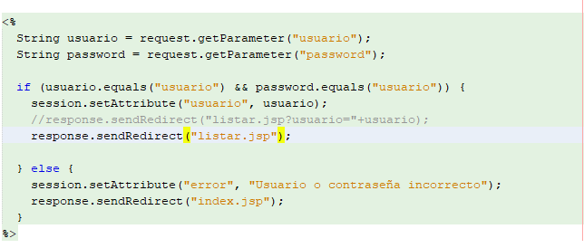
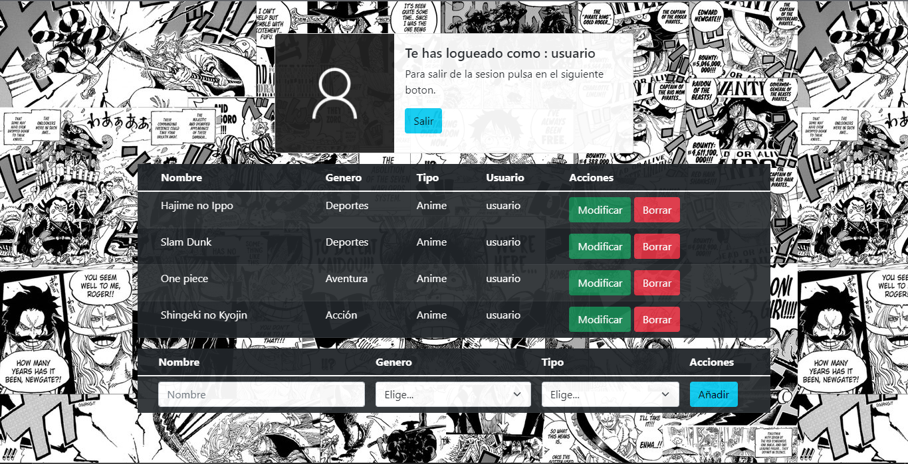
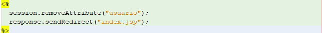
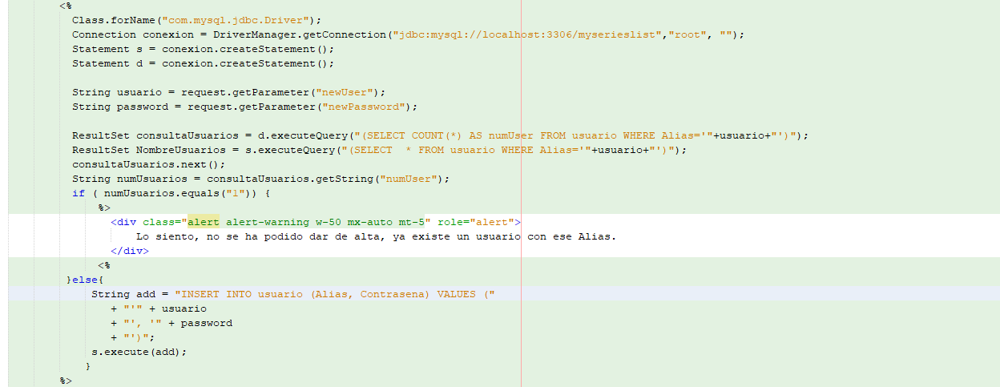
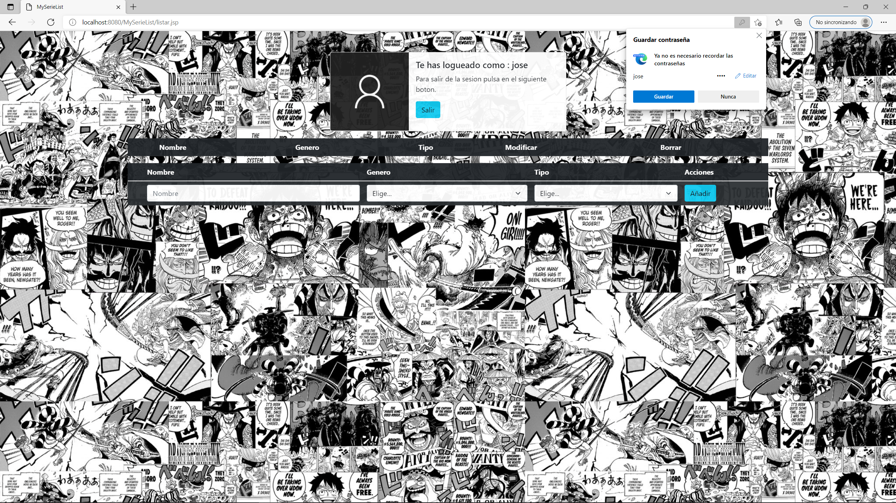
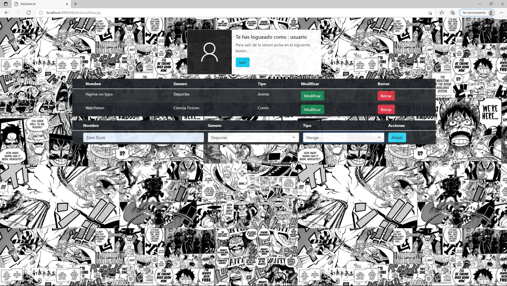

# MySerieList
Como su nombre indica, será una aplicación en la que se podrán añadir, modificar y borrar Series/Peliculas/Documentales... vistas, así como añadir información relevante sobre el mismo. El código utilizado se encuentra en la carpeta CRUD de este repositorio.

La funcionalidad de esta aplicacion es recordarte que series,comics,peliculas... has visto. Esta idea me surgio debido a que uno de mis pasatiempos es ver anime y leer mangas. Y he visto tantos que cuando me preguntan amigos o conocidos que les puedo recomendar nunca me acuerdo de las series que vi hace tiempo o con un nombre muy complicado. Y seguro que a mas de una persona le pasa igual, por eso he decido hacer esta aplicacion estilo "diario" o "lista".

### 1º: index/login

Lo primero que  veras al entrar en la aplicacion sera un formulario de Logeo. En el que podras entrar usando el usuario "usuario" y su contraseña correspondiente (usuario). Si los datos son erroneos no te permitira avanzar a la pagina principal. Que en este caso sera el listado de todas las series, peliculas, documentales, mangas, podcasts... Que el usuario ha ido viendo. 

El codigo que he usado en para validar el Login es el siguiente, el index pasa primero por este archivo (login.jsp) y valida que el usuario existe y guarda el parametro en una variable de sesion para despues de ser validado enviarme a la pagina del listado.

### 2º: Listado y Logout
Después de que el usuario haya sido validado, podra ver la lista de sus series y peliculas que tiene, en el caso de no tener podra añadirlas usando el boton añadir, el cual lo llevara a anadir.jsp. Tambien podra modificar datos y borrar esos datos. En todos los casos pasara por su archivo correspondiente.

En el caso de que el usuario quiera cerrar sesion dara click en salir y esta pasara por el archivo logout.jsp enviandolo al index y borrando la variable de sesión. Aqui puedes ver el codigo.

### 3º: Registro Usuario

Si llega un nuevo usuario y quiere registrarse, presionaria el boton en la pagina de login de registrar y lo llevaria a esta pagina, en la que puede poner su alias y su contraseña. El formulario de registro es algo sencillo. Compruebo que el usuario no exista y si existe salta un mensaje diciendole que ya existe ese alias y que use otro.

Aqui esta el codigo que uso para comprobar que el usuario no exista y que pueda registrarse.

Y aqui podemos ver como se inicia sesion con el nuevo usuario creado.

  
  

### 4º: Añadir

Esta parte se activa al introducir datos en el formulario de listar, cuando el usuario presione sobre añadir lo redigira hacia una pagina que le confirmara que ha sido añadida exitosamente y le mostrara la linea que ha añadido.

Después para ver la lista completa el usuario puede hacer click sobre ver en lista y le mostrara la lista completa.

